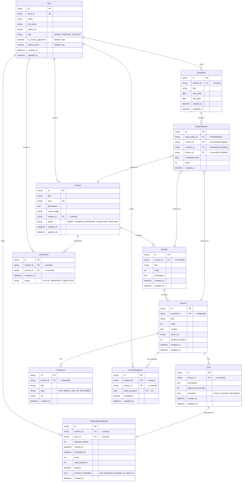

# System Specification: Learning Management System (LMS) API

## 1. Entity Relationship Diagram (ERD)

---

## 2. Business Rules by Domain

### Domain 1 — Enrollment
* **Enrollment Creation**:
  * Students may self-enroll.
  * Administrators may enroll any student.
  * Creators may not enroll students.
* **Duplicate Prevention**:
  * A student may have only one Enrollment per Course.
  * Duplicate enrollments are prohibited.
* **Enrollment Lifecycle**:
  * Transitions: `ACTIVE` &rarr; `DROPPED` &rarr; `ACTIVE` or `ACTIVE` &rarr; `COMPLETED`.
  * Re-enrollment reuses the existing Enrollment record.
  * Completion occurs automatically when the associated Course is completed.

### Domain 2 — Learning Progression / Module Unlocking
* **Access Rules**:
  * Modules unlock sequentially based on completion.
  * Lessons within an unlocked Module may be accessed in any order.
* **Unlock Flow**:
  * Module 1 completed &rarr; Module 2 unlocked &rarr; Module 2 completed &rarr; Module 3 unlocked.
* **Unlock Logic**:
  * Module availability is derived dynamically from the completion state of the immediately preceding Module.
  * Unlock state is derived and not persisted in the database.
* **Module Completion**:
  * Determined by completion rules. For the MVP, a Module is complete when all its Lessons are completed.

### Domain 3 — Lesson Progress
* **Progress Tracking**:
  * Recorded as a decimal value from 0.0 to 1.0.
  * Progress is monotonic (never automatically decreases).
  * The highest reported progress is preserved across devices.
* **Completion**:
  * Lesson completion is reached when video progress &ge; 0.99 (99% or greater) to account for client rounding/buffering.
* **Manual Reset**:
  * Students may manually reset progress (sets completed = false, video_progress = 0).
* **Multi-device & Auth**:
  * One single shared progress record per lesson per authenticated student. No progress tracking for guests.

### Domain 4 — Quiz Lifecycle
* **Attempt Creation**:
  * Created only when a student starts the quiz.
* **Attempt Lifecycle**:
  * `START` &rarr; `SUBMITTED`.
  * Attempts cannot be resumed. Leaving the quiz abandons the attempt. A new start creates a new attempt.
* **Bulk Submission**:
  * Student answers are evaluated against the Quiz JSON in bulk via a single POST request on submission.
* **Scoring**:
  * Calculated immediately on submission. Stores raw score and total questions (percentage is derived).
* **Review**:
  * Students can review all previous attempts, including submission date, score, selected/correct answers.
* **Quiz Changes**:
  * Structural quiz edits only affect future attempts. Historical attempts preserve quiz state at submission.

### Domain 5 — Study Plans
* **Purpose**:
  * Organizational only. Does not affect course progression, enrollment, or quiz states.
* **Ownership**:
  * A student may own multiple study plans.
* **Study Plan Items**:
  * References exactly one Course, Module, or Lesson. Uses mutually exclusive nullable foreign keys to enforce referential integrity. Validations must reject items with 0 or >1 reference.
* **Duplicate Prevention & Hierarchy**:
  * Duplicates are prohibited within the same Study Plan.
  * A Course and any of its child Modules/Lessons cannot coexist in the same Study Plan.
  * A Module and any of its child Lessons cannot coexist in the same Study Plan.
* **Completion & Deletion**:
  * Completion is derived dynamically. Deleting a Study Plan removes its items without affecting historical learning data.

### Domain 6 — Creator Content Management
* **Course Ownership**:
  * Exactly one Creator owns a course. Only the owner or an Admin can manage it.
* **Course Lifecycle**:
  * `DRAFT` &rarr; `PENDING_APPROVAL` &rarr; `PUBLISHED` &rarr; `ARCHIVED`.
  * Draft: Visible only to owner/admins. Fully editable. Not enrollable.
  * Pending Approval: Visible only to owner/admins. Locked for editing.
  * Published: Visible to students. Available for enrollment.
  * Archived: Closed to new enrollments; existing students retain access.
* **Publication Rules**:
  * Only admins can publish (approve). Creators submit for review. Rejections return course to Draft.
* **Editing Restrictions (Post-Publication)**:
  * Creators can *add* new Modules and Lessons.
  * Creators *cannot* modify existing Course/Module/Lesson titles, video content, quiz structures, questions, or options.

### Domain 7 — Role & Permission Rules
* **Roles**: `ADMIN`, `CREATOR`, `STUDENT`.
* **Creator Approval**:
  * Must be approved by an Admin (`is_creator_approved = true`) before creating, modifying, or publishing courses.
* **Permissions Matrix**:
  * `ADMIN`: Unrestricted authority, manages users, roles, can approve creators, override ownership.
  * `CREATOR`: Manages owned courses, modules, lessons, quizzes. Cannot publish directly. Cannot access other creators' drafts or student history.
  * `STUDENT`: Manages own enrollments, progress, attempts, and study plans. No content modification.

### Domain 8 — Deletion & Data Integrity
* **No Physical Deletions**:
  * Historical Learning Records (Enrollments, Lesson Progress, Quiz Attempts) are immutable and must never be physically deleted.
  * Soft-delete state changes (e.g., status flags, `status_active` booleans) are used instead of physical deletes.
  * No DB CASCADE deletes on entities linked to learning records.
* **Course Deletion**:
  * Published or archived courses with historical learning records cannot be physically deleted.
* **Student-owned Data**:
  * Only Study Plans and Study Plan Items may be physically deleted.

### Domain 9 — Validation Rules
* **Layers**: Structural, Business Rule, and State Transition.
* **Ordering Validation**:
  * Entities supporting manual ordering (Modules, Lessons, Questions, Study Plan Items) must maintain unique, continuous, and deterministic ordering.

### Domain 10 — Cross-Domain Business Rules
* **Derived State over Duplication**:
  * Dynamic values (unlocking, completion, progress percentage) are derived dynamically instead of persisted.
* **Failure Principle**:
  * Invalid state transitions and business violations must return immediate errors rather than silently correcting data.

---

## 3. REST API Specification

Base Path: `/api/v1/`

### 1. Authentication & Users
* `GET  /users/me/` - Retrieve authenticated profile, role, and application status. (ADMIN, CREATOR, STUDENT)
* `PATCH /users/me/` - Update profile information. Role changes not permitted. (ADMIN, CREATOR, STUDENT)
* `GET  /users/` - View all users for administration. (ADMIN)
* `PATCH /users/{id}/role/` - Assign/modify/revoke user roles. (ADMIN)
* `PATCH /users/{id}/status/` - Activate or deactivate users without deleting history. (ADMIN)

### 2. Creator Content Management & Curriculum
* `GET  /courses/` - List courses. Students see published; creators see owned; admins see all. (ADMIN, CREATOR, STUDENT)
* `POST /courses/` - Create a new draft course. (CREATOR, ADMIN)
* `GET  /courses/{id}/` - Retrieve course details. (ADMIN, CREATOR owner, STUDENT if published)
* `PATCH /courses/{id}/` - Modify course info (subject to lifecycle limits). (ADMIN, CREATOR owner)
* `POST /courses/{id}/submit-review/` - Submit draft course for publication review. (CREATOR owner)
* `POST /courses/{id}/approve/` - Approve pending course publication. (ADMIN)
* `POST /courses/{id}/reject/` - Return pending course to draft state. (ADMIN)
* `POST /courses/{id}/archive/` - Archive a course. (ADMIN, CREATOR owner)

#### Modules
* `GET  /courses/{course_id}/modules/` - List modules in a course. (ADMIN, CREATOR owner, STUDENT)
* `POST /courses/{course_id}/modules/` - Add module to course. (CREATOR owner, ADMIN)
* `PATCH /modules/{id}/` - Update module details (subject to lifecycle limits). (ADMIN, CREATOR owner)
* `POST /courses/{course_id}/modules/reorder/` - Reorder modules manually. (CREATOR owner, ADMIN)

#### Lessons & Resources
* `GET  /modules/{module_id}/lessons/` - List lessons in a module. (ADMIN, CREATOR owner, STUDENT)
* `POST /modules/{module_id}/lessons/` - Add lesson to module. (CREATOR owner, ADMIN)
* `GET  /lessons/{id}/` - Retrieve lesson content. (ADMIN, CREATOR owner, STUDENT)
* `PATCH /lessons/{id}/` - Modify lesson (subject to lifecycle limits). (ADMIN, CREATOR owner)
* `POST /modules/{module_id}/lessons/reorder/` - Reorder lessons manually. (CREATOR owner, ADMIN)
* `GET  /lessons/{lesson_id}/resources/` - List lesson resources. (ADMIN, CREATOR owner, STUDENT)
* `POST /lessons/{lesson_id}/resources/` - Add resource. (CREATOR owner, ADMIN)
* `PATCH /resources/{id}/` - Modify resource metadata. (CREATOR owner, ADMIN)

### 3. Enrollments & Learning Progress
* `GET  /enrollments/` - View current student's enrollments. (STUDENT)
* `GET  /courses/{course_id}/enrollment/` - Check enrollment status for course. (STUDENT)
* `POST /courses/{course_id}/enroll/` - Create or reactivate enrollment (Idempotent). (STUDENT)
* `POST /enrollments/{id}/drop/` - Drop an enrollment. (STUDENT)
* `POST /admin/enrollments/` - Enroll a student administratively. (ADMIN)
* `GET  /lessons/{lesson_id}/progress/` - Retrieve lesson progress. (STUDENT)
* `PATCH /lessons/{lesson_id}/progress/` - Report lesson progress. (STUDENT)
* `POST /lessons/{lesson_id}/progress/reset/` - Reset lesson progress. (STUDENT)
* `GET  /courses/{course_id}/progress/` - Retrieve derived course progress. (STUDENT)
* `GET  /courses/{course_id}/learning-path/` - Retrieve modules with calculated unlock status. (STUDENT)

### 4. Assessments / Quiz System
* `GET  /lessons/{lesson_id}/quizzes/` - Retrieve quizzes attached to a lesson. (ADMIN, CREATOR owner, STUDENT)
* `POST /lessons/{lesson_id}/quizzes/` - Create a quiz (Accepts JSON question array). (CREATOR owner, ADMIN)
* `PATCH /quizzes/{id}/` - Modify quiz structure. (CREATOR owner, ADMIN)
* `POST /quizzes/{quiz_id}/attempts/` - Start a quiz attempt. (STUDENT)
* `POST /attempts/{id}/submit/` - Bulk-submit attempt (JSON answers) and score it. (STUDENT)
* `GET  /quizzes/{quiz_id}/attempts/` - Review previous attempts. (STUDENT)
* `GET  /attempts/{id}/` - View attempt details, answers, and score. (STUDENT)

### 5. Study Plans
* `GET  /study-plans/` - List student's study plans. (STUDENT)
* `POST /study-plans/` - Create a study plan. (STUDENT)
* `GET  /study-plans/{id}/` - Retrieve study plan with derived completion. (STUDENT)
* `PATCH /study-plans/{id}/` - Update study plan metadata. (STUDENT)
* `DELETE /study-plans/{id}/` - Delete a study plan. (STUDENT)
* `POST /study-plans/{id}/items/` - Add item reference (Course/Module/Lesson). (STUDENT)
* `PATCH /study-plan-items/{id}/` - Update item ordering. (STUDENT)
* `DELETE /study-plan-items/{id}/` - Remove item from plan. (STUDENT)

### 6. Administrative Operations
* `GET  /admin/enrollments/` - Inspect all enrollment records. (ADMIN)
* `POST /admin/enrollments/` - Enroll a student administratively. (ADMIN)

Note: Admin course listing and user management are covered by existing endpoints:
* `GET /courses/` returns all courses for admins (role-filtered).
* `GET /users/` is admin-only and returns all users.
